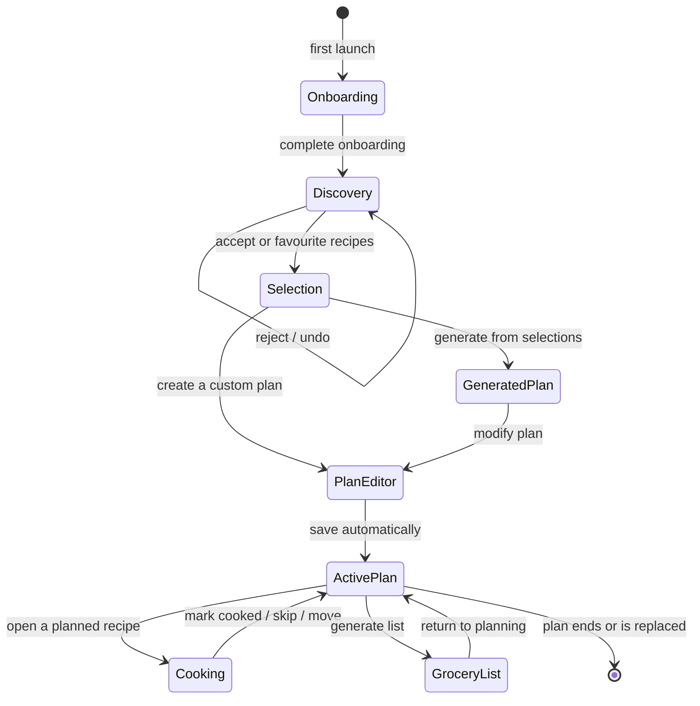
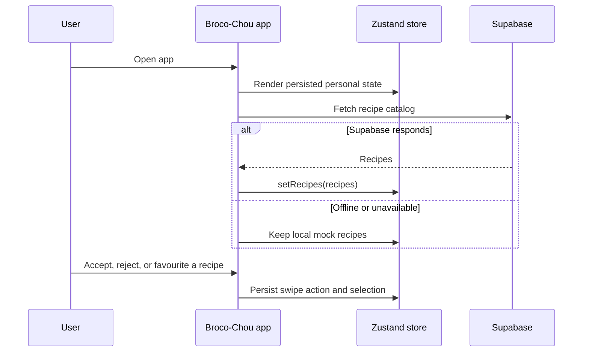
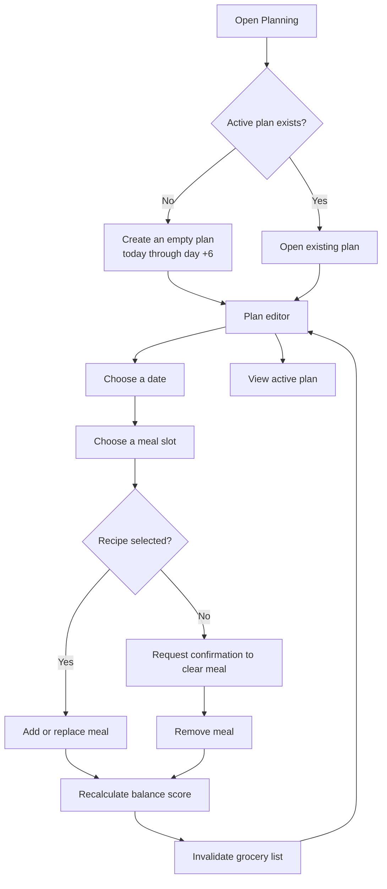
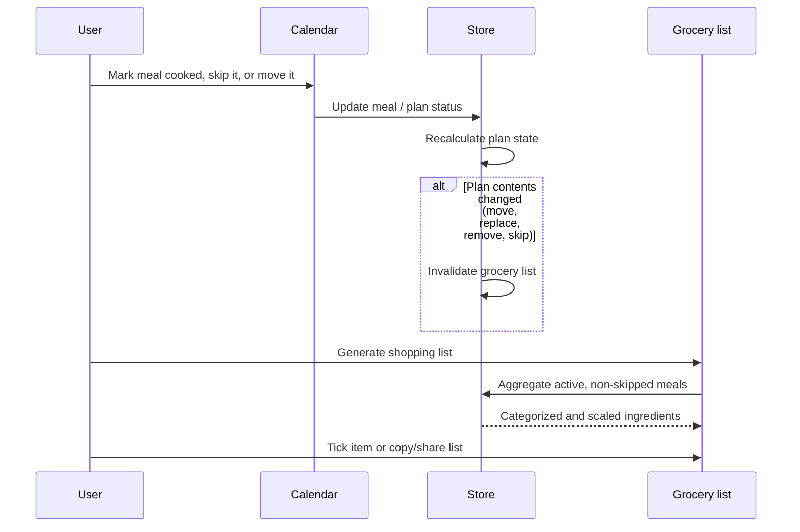
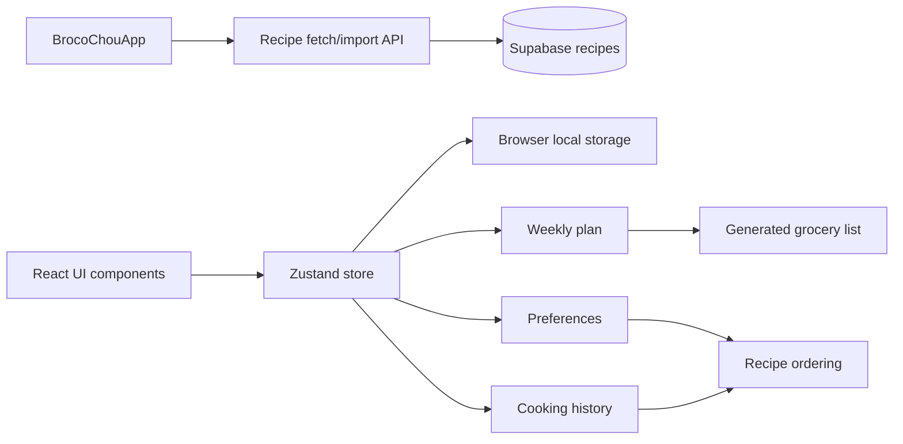

# Broco-Chou application workflows

This document describes the user-facing workflows and the client-side state that supports them. The app currently persists personal planning state in Zustand/local storage and loads the recipe catalog from Supabase when it is available.

## Application state

## Recipe catalog and discovery sequence

## Create or edit a seven-day plan

## Cooking, moving, and shopping flow

## State ownership

## Important implementation rules

- A plan spans the local calendar day of creation plus the following six days.
- Editing a plan invalidates its grocery list; regenerate before shopping.
- Recipe catalog loading must fail gracefully: the local catalog remains usable when Supabase is unavailable.
- Only non-skipped planned meals contribute ingredients to the grocery list.
- Persisted dates must be read through `new Date(...)` before comparing or rendering them.
